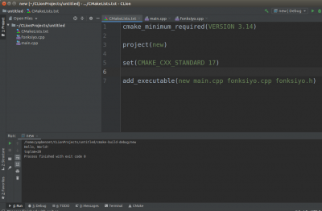
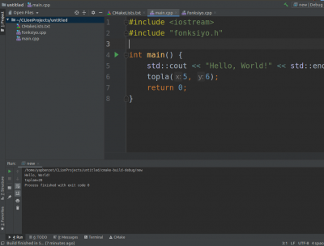
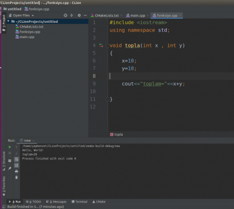
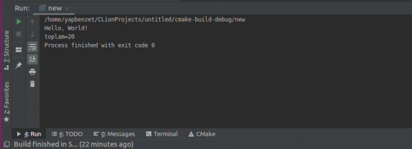

# Repository - C++ & CMake

## CMAKE NEDİR?

CMake, derleme işlemini bir işletim sisteminde ve derleyiciden bağımsız bir şekilde yöneten genişletilebilir, açık kaynaklı bir sistemdir.

CMake, platformlar arası bir inşa süreci yöneticisi olmayı hedefledi, böylece belirli sözdizimi ve yerleşik özelliklerle kendi komut dosyası dili olduğunu tanımlar. CMake kendisi bir yazılım programıdır, bu nedenle gerçek derleme dosyasını yorumlamak ve oluşturmak için komut dosyası ile çağrılmalıdır. Bir geliştirici, projeler için CMake dilini kullanarak basit veya karmaşık bina komut dosyaları(building scripts) yazabilir. Çoğu çapraz platform sisteminden farklı olarak, CMake, yerel yapı ortamı ile birlikte kullanılmak üzere tasarlanmıştır. Her kaynak dizine ( CMakeLists.txt dosyaları adı verilen ) yerleştirilen basit yapılandırma dosyaları, normal şekilde kullanılan standart derleme dosyalarını (örneğin, Unix'teki Makefiles ve Windows MSVC'deki projeler / çalışma alanları) oluşturmak için kullanılır.

CMake, kaynak kodunu derleyecek, kitaplıklar , sarmalayıcılar oluşturabilecek ve isteğe bağlı kombinasyonlarda çalıştırılabilir ikili dosyalar oluşturabilecek yerel bir derleme ortamı oluşturabilir. CMake, yerinde ve yer dışında inşaları destekler ve bu nedenle tek bir kaynak ağacından birden çok yapıyı destekleyebilir.

CMake, statik ve dinamik kütüphane yapıları için desteklere sahiptir. CMake'nin bir diğer güzel özelliği de, grafiksel bir editörle kullanılmak üzere tasarlanmış bir önbellek dosyası oluşturabilmesi. Örneğin, CMake çalışırken, içerdiği dosyaları, kütüphaneleri ve çalıştırılabilir dosyaları bulur ve isteğe bağlı derleme yönergeleriyle karşılaşabilir. Bu bilgiler, yerel derleme dosyalarının oluşturulmasından önce kullanıcı tarafından değiştirilebilecek olan önbellekte toplanır.

CMake komut dosyaları kaynak yönetimini de kolaylaştırır, çünkü komut dosyasını tek bir dosyada ve daha düzenlenmiş, okunabilir bir biçimde derlemeyi kolaylaştırır.

## KÖKENİ

CMake, Görünür İnsan Projesi'nin bir parçası olarak NLM tarafından finanse edilen Insight Segmentation ve Registration Toolkit (ITK) için güçlü, platformlar arası bir yapı ortamı ihtiyacına cevap olarak oluşturuldu. Görselleştirme Araç Takımı (VTK) açık kaynaklı 3D grafik ve görselleştirme sistemini desteklemek için Ken Martin ve diğer geliştiriciler tarafından oluşturulan bilgisayar üreticisi denilen daha önceki bir sistemden etkilenmiştir . CMake'i oluşturmak için Kitware'deki Bill Hoffman, pcmaker'dan bazı temel fikirleri dahil etti ve Unix yapılandırmasının bazı işlevlerini benimseme düşüncesiyle, daha fazlasını ekledi.İlk CMake uygulaması 2000 yılının ortalarında yayınlandı ve 2001 yılının başlarında hızla gelişdi. Birçok gelişme, CMake'i kendi sistemlerine dahil eden diğer geliştiricilerin etkilerinden kaynaklanıyordu. Örneğin, VXL yazılım topluluğu CMake'i yapı ortamı olarak kabul etmiş ve birçok temel özelliğe katkıda bulunmuştur. Brad King, CABLE'ı desteklemek için çeşitli özellikler ve otomatik sarma ortamı ve GCC-XML'i ekledi ve GE Corporate R&D, test altyapılarını ( DART ) desteklemeyi gerekli kıldı . VTK'nın yapı ortamının CMake'e geçişini desteklemek ve Gelişmiş Bilgi İşlem Laboratuarını , paralel bir görselleştirme sistemi olan ParaView'i desteklemek için başka özellikler Los Alamos Ulusal Laboratuvarı'nda eklendi.

## CMake ile Popüler Açık Kaynak Projeler

İnşa amaçlı CMake kullanan popüler açık kaynaklı projeler listesi:

[OpenCV](https://github.com/opencv/opencv) 

[Caffe2](https://github.com/caffe2/caffe2)

[MySQL Sunucusu](https://github.com/mysql/mysql-server)

[Daha uzun bir liste için Wikipedia'ya bakın](https://en.wikipedia.org/wiki/CMake#Applications_that_use_CMake)

## BİR KODLAMA DİLİ OLARAK CMAKE

CMake, karmaşık dizin hiyerarşilerini ve birkaç kütüphaneye bağlı uygulamaları desteklemek için tasarlanmıştır. Örneğin; CMake, uygulama araç setlerine ve ek koda bağlı olan birden fazla araç setinden (yani kütüphanelerden) oluşan projeleri destekler. CMake, daha sonra derlenen ve son bir uygulamaya bağlanan kodu üretmek için yürütülebilir dosyaların oluşturulması gereken durumları da ele alabilir. CMake açık kaynak bir tasarıma sahip olduğundan yeni özellikleri desteklemek için gerektiğinde geliştirilebilir. CMake'i kullanmak basittir. Derleme işlemi, bir projeyi oluşturan her dizinde (alt dizinler dahil) bir veya daha fazla CMakeLists.txt dosyası oluşturarak kontrol edilir. Her CMakeLists.txt bir veya daha fazla komuttan oluşur. Her komut, COMMAND (args…) formuna sahiptir, burada COMMAND komutun ismidir ve args, boşluklarla ayrılmış bir argüman listesidir. CMake önceden tanımlanmış birçok komut sağlar, ancak gerekirse, kendi komutlarınızı ekleyebilirsiniz.

### CMake Kullanımı

CMake kullanımı için işletim sistemine ait komut yorumlayıcısına cmake yazmak yeterli olacaktır. Komut çalıştırıldıktan sonra ayaların bulunduğu CMakeLists.txt dosyasını arayacaktır.

#### Projenin oluşturulması:

Geliştirilen ve geliştirilmiş bir proje için CMake ayarlarının yapılması için CMakeLists.txt dosyasının oluşturulması gerekir.

Komut yazarken girinti zorunlu ama tavsiye edilmez. CMake'te satır sonunda , kullanılmaz.

Bu dosya içerisinde aşağıdaki gibi temel ayarlar yer alır.

```CMAKE
cmake_minimum_required(VERSION 2.8)
project (projeAdi)
add_executable(projeAdı merhabadunya.cpp)
add_library
```

* Burada yer alan **cmake_minimum_required** proje için gerekli olan CMake sürümünü ifade eder.
* Alt kısımda yer alan **project** ifadesi ise projenin adının ifade eder.
* **add_executable** ise çalıştırılabilir dosyanın hangi dosyalarla oluşturulacağını ifade eder.
* En alt kısımda yer alan **add_library** kaynak dosyalardan oluşturulacak bir kütüphane ekler.



```C++
cmake_minimum_required(VERSION 3.14)
 
project(new)
 
set(CMAKE_CXX_STANDARD 17)
 
add_executable(new main.cpp fonksiyo.cpp fonksiyo.h)
```


```C++
#include <iostream>
#include "fonksiyo.h"
 
int main() {
    std::cout << "Hello, World!" << std::endl;
    topla(5, 6);
    return 0;
}
```



```C++
#include <iostream>
using namespace std;
 
void topla(int x , int y)
{
    x=10;
    y=10;
 
    cout<<"toplam="<<x+y;
 
}
```


### CMake Değişkenleri

CMake varsayılan olarak sistem bileşenlerinde önceden tanımlanmış değişkenleri içerir. Değişkenler büyük küçük harfe duyarlıdır, Yalnızca alfa sayısal karakterleri kullanın ve çizgi ( _ , -) tanımı değişken için kullanılabilir.

* Değişkenlere **${ variable_name}** ifadesi ile erişilebilir.
```CMake
message("CXX Standard: ${CMAKE_CXX_STANDARD}")
set(CMAKE_CXX_STANDARD 14)
```

* Yeni değişken tanımlamaları ise aşağıdaki gibi yapılabilir.
```CMake
set(TRIAL_VARIABLE "VALUE")
message("${TRIAL_VARIABLE}")
```
Aşağıda örnek bir kullanım örneği verilmiştir, Derleme işlemi sırasında tüm uyarıları etkinleştirmek istediğinizde **-Wall to build** komutu yazabilirsiniz. Kodunuzu CMake ile oluşturuyorsanız, set komutunu kullanarak -Wall bayrağını ekleyebilirsiniz.
**Örneğin;**

```CMake
set(CMAKE_CXX_FLAGS "-Wall")
# append flag, best practice, suggested, don't lose previously defined flags
set(CMAKE_CXX_FLAGS "${CMAKE_CXX_FLAGS} -Wall")
```

### Referanslar

https://medium.com/@onur.dundar1/cmake-tutorial-585dd180109b

https://medium.com/@kiranjv/cmake-b55db5c8acb

https://en.wikipedia.org/wiki/CMake#Applications_that_use_CMake


