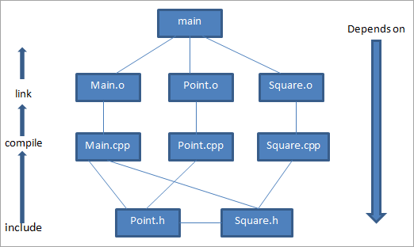

# flying-cavalry
Flying Cavalry Project - Ucan Kavalye Projesi 
# Repository - C++ & Makefile

Learn how to create makefile to work with C++ file.

## C ++ 'da Makefile Nasıl Oluşturulur ve Kullanılır

Herhangi bir C ++ projesinde, önemli hedeflerden biri projenin yapımını basitleştirmektir.Bunun için tüm bağımlılıkları ve proje dosyalarını tek bir yerden alır ve tek seferde çalıştırırız, böylece istenen çıktıyı tek bir komutla elde ederiz. Aynı zamanda, proje dosyalarından herhangi biri değiştirildiğinde, tüm projeyi yeniden oluşturma zahmetine girmemize gerek kalmaz, yani projede bir veya iki dosya değiştirildiğinde, yalnızca bu değiştirilen dosyaları yeniden  oluşturur ve ardından yürütmeye(execution) devam ederiz.

Bunlar, C ++ 'da "make" tool ve "makefiles" tarafından ele alınan özelliklerdir. Şimdi, makefile dosyalarının tüm ana yönlerini ve bunların C ++ 'daki uygulamalarını tartışacağız.

### Make Tool

Make bir [UNIX](https://en.wikipedia.org/wiki/Unix) aracıdır ve bir projenin farklı modüllerinden çalıştırılabilir yapıyı basitleştirmek için bir araç olarak kullanılır. Makefile'da hedef girdiler olarak belirtilen çeşitli kurallar vardır. Make tool tüm bu kuralları okur ve buna göre davranır.

**Örneğin**, bir kural herhangi bir bağımlılık belirtiyorsa, bu durumda make tool derleme amaçlı bu bağımlılığı içerecektir. Make komutu makefile'da modüller oluşturmak veya dosyaları temizlemek için kullanılır. 

**Make'in genel sözdizimi şöyledir:**

```makefile
%make target_label             #target_label makefile'da belirli bir hedeftir
```

*Örneğin*, dosyaları temizlemek için rm komutlarını çalıştırmak istersek şunu yazarız:

```makefile
%make clean                #burada clean, rm komutları için belirtilen bir target_label'dır.
```
### C++ Makefile

Makefile, hedefleri oluşturmak için "make" komutu tarafından kullanılan veya başvurulan bir metin dosyasından başka bir şey değildir. Bir makefile ayrıca her dosya için kaynak düzeyi bağımlılıkları ve yapı sırası bağımlılıkları gibi bilgileri içerir.

Şimdi makefile'ın genel yapısına bakalım.

Bir makefile tipik olarak değişken tanımlamaları(variable declarations) ile başlar ve ardından belirli hedefler oluşturmak için bir dizi hedef girdi gelir. Bu hedefler, .o veya C veya C ++ 'daki diğer yürütülebilir dosyalar ve Java'daki .class dosyaları olabilir.

Ayrıca, hedef etiket tarafından belirtilen bir dizi komutu yürütmek için bir dizi hedef girişimiz olabilir.

**Dolayısıyla genel bir makefile aşağıda gösterildiği gibidir:**

```makefile
# comment
 
target:  dependency1 dependency2 ... dependencyn
      <tab> command
 
# (not: make'in çalışması için komut satırındaki <tab> gereklidir)
```

**Makefile'ın basit bir örneği aşağıda gösterilmiştir.**

```makefile
# myprogram.o ve mylib.lib'den yürütülebilir(executable) myprogram oluşturmak için bir yapı komutu
all:myprogram.o mylib.o
        gcc –o myprogram myprogram.o mylib.o
clean:
        $(RM) myprogram
```

Yukarıdaki makefile'da iki hedef etiket(target labels) belirledik, ilki myprogram ve mylib nesne dosyalarından çalıştırılabilir oluşturmak için "all" etiketidir. İkinci hedef etiket "clean", "myprogram" adındaki tüm dosyaları kaldırır.

**Makefile'ın başka bir varyasyonunu görelim.**

```makefile
# derleyici: C programı için gcc, C ++ için g ++ olarak tanımlayın
  CC = gcc
 
  # derleyici bayrakları(compiler flags):
  #  -g     - bu bayrak çalıştırılabilir dosyaya hata ayıklama bilgisi ekler
  #  -Wall  - bu bayrak çoğu derleyici uyarısını açmak için kullanılır
  CFLAGS  = -g -Wall
 
  # The build target 
  TARGET = myprogram
 
  all: $(TARGET)
 
  $(TARGET): $(TARGET).c
              $(CC) $(CFLAGS) -o $(TARGET) $(TARGET).c
 
  clean:
              $(RM) $(TARGET)
```

Yukarıdaki örnekte gösterildiği gibi, bu makefile'da, kullandığımız derleyici değerini içeren 'CC' değişkenini kullanıyoruz (bu durumda GCC). Başka bir değişken "CFLAGS", kullanacağımız derleyici bayraklarını içerir.

Üçüncü değişken 'TARGET', oluşturmamız gereken çalıştırılabilir dosya için programın adını içerir.

Makefile'ın bu varyasyonunun ölçü avantajı, derleyici, derleyici bayrakları veya çalıştırılabilir program adında bir değişiklik olduğunda sadece kullandığımız değişkenlerin değerlerini değiştirmemiz gerektiğidir.

**Make Ve Makefile Örneği**

Aşağıdaki dosyaları içeren bir program örneğini düşünün:

* **Main.cpp**: Ana sürücü programı
* **Point.h**: Point sınıfı için başlık dosyası
* **Point.cpp**: Point sınıfı için CPP uygulama dosyası
* **Square.h**: Square sınıfı için başlık dosyası
* **Square.cpp**: Square sınıfı için CPP uygulama dosyası

Yukarıda verilen .cpp ve .h dosyalarıyla, .o dosyaları oluşturmak için bu dosyaları ayrı ayrı derlememiz ve ardından bunları main adlı yürütülebilir dosyaya bağlamamız gerekir.

Şimdi bu dosyaları ayrı ayrı derliyoruz.

* **g++ -c main.cpp**: main.o oluşturur
* **g++ -c point.cpp**: point.o oluşturur 
* **g++ -c square.cpp**: square.o oluşturur

Ardından, çalıştırılabilir main'i oluşturmak için nesne dosyalarını birbirine bağlarız.

**g++ -o main main.o point.o square.o**

Daha sonra, programın belirli bölümleri güncellendiğinde dosyalardan hangisini yeniden derlememiz ve yeniden oluşturmamız gerektiğine karar vermemiz gerekiyor. Bunun için, uygulama dosyalarının her biri için çeşitli bağımlılıkları gösteren bir **bağımlılık tablomuz** olacak.

Yukarıdaki dosyalar için bağımlılık tablosu aşağıda verilmiştir.



Dolayısıyla, yukarıdaki bağımlılık tablosunda, kökte çalıştırılabilir "main" i görebiliriz. Çalıştırılabilir "main", nesne dosyalarından oluşur; sırasıyla main.cpp, point.cpp ve square.cpp derlenerek oluşturulan main.o, point.o, square.o.

Tüm cpp uygulamaları, yukarıdaki tabloda gösterildiği gibi başlık dosyalarını kullanır. Yukarıda gösterildiği gibi main.cpp, hem point.h hem de square.h'ye başvurur, sürücü programıdır ve point ve square sınıflarını kullanır.

Sonraki dosya point.cpp referanslar point.h. Üçüncü dosya square.cpp, kare çizmek için bir noktaya ihtiyaç duyacağı için square.h ve point.h dosyalarına da başvurur.

Yukarıdaki bağımlılık tablosundan, .cpp dosyası tarafından başvurulan herhangi bir .cpp dosyası veya .h dosyası her değiştiğinde, o .o dosyasını yeniden oluşturmamız gerektiği açıktır. Örneğin, main.cpp değiştiğinde, main.o'yu yeniden oluşturmamız ve ana yürütülebilir dosyayı oluşturmak için nesne dosyalarını yeniden bağlamamız gerekir.


